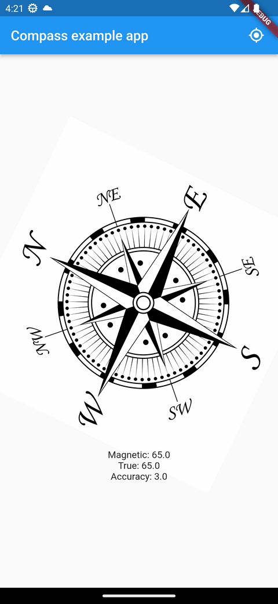

# lat_compass

Compass plugin written in native code.

It provides true-north, magnetic-north and accuracy.

See the example for more details.

## Getting started

```yaml
dependencies:
  lat_compass: ^any
```

## Usage
```dart
LatCompass().stream?.listen((event) {
  event?.magneticHeading;
  event?.trueHeading;
  event?.accuracy;
})
```
